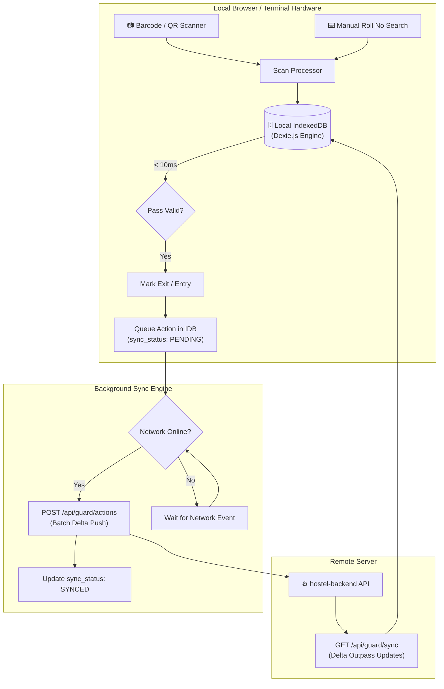

# 🛡️ NITH Hostel Management System — Guard Terminal (`hostel-guard`)

[](https://react.dev/)
[](https://dexie.org/)
[](https://fingerprint.com/)
[](https://tailwindcss.com/)
[](https://offlinefirst.org/)

The high-throughput, offline-resilient gate security terminal for **NIT Hamirpur**. Designed for rugged deployment at campus Main Gates and Hostel Gate checkpoints, it features hardware-locked device licensing, sub-10ms QR/barcode gate pass verification, automatic offline action queuing, and Day Scholar movement logging.

---

### 🌐 Related Repositories in the NITH Ecosystem

| Repository | Description | Live GitHub Link |
| :--- | :--- | :--- |
| **`hostel-backend`** | Core REST API Gateway & PostgreSQL Database Engine | [🔗 github.com/workonlly/hostel-backend](https://github.com/workonlly/hostel-backend) |
| **`hostel-frontend`** | Student Web Application (Registration, Outpass Forms & Dynamic QR Gate Pass) | [🔗 github.com/workonlly/hostel-frontend](https://github.com/workonlly/hostel-frontend) |
| **`hostel-authority`** | Authority & Administration Portal (Chief Warden, Warden & Attendant Dashboards) | [🔗 github.com/workonlly/hostel-authority](https://github.com/workonlly/hostel-authority) |

---

## 📑 Table of Contents

- [Offline-First Architecture](#-offline-first-architecture)
- [Hardware Fingerprinting & Device Gatekeeper](#-hardware-fingerprinting--device-gatekeeper)
- [Dual-Station Modes](#-dual-station-modes)
  - [1. Main Gate Terminal](#1-main-gate-terminal)
  - [2. Hostel Gate Terminal](#2-hostel-gate-terminal)
- [Tech Stack](#-tech-stack)
- [Directory Structure](#-directory-structure)
- [Local Database Schema (IndexedDB)](#-local-database-schema-indexeddb)
- [Delta Synchronization Engine](#-delta-synchronization-engine)
- [Environment Variables](#-environment-variables)
- [Local Setup & Development](#-local-setup--development)
- [Production Build & Docker Deployment](#-production-build--docker-deployment)
- [Troubleshooting & Offline Recovery](#-troubleshooting--offline-recovery)

---

## ⚡ Offline-First Architecture

Campus gates often experience intermittent network connectivity. The Guard Terminal is architected so that **network outages never stop or slow down gate verification**:



---

## 🔒 Hardware Fingerprinting & Device Gatekeeper

To prevent unauthorized personnel from opening the guard terminal on unapproved personal devices, access is bound to the physical machine hardware:

1. **Hardware Hashing:** Upon startup, `fingerprint.js` calculates a composite hash from Canvas rendering, WebGL vendor parameters, screen resolution, and browser audio hardware.
2. **Terminal Licensing:** The guard enters the Chief Warden's designated activation code and telephone number during first-time terminal provisioning.
3. **Cryptographic Validation:** The backend validates the activation code using timing-safe comparisons and issues a hardware-locked session token.
4. **Gatekeeper Shield (`DeviceGatekeeper.jsx`):** Wraps all application routes. Unregistered or revoked devices are immediately redirected to the activation lock screen.

---

## 🚪 Dual-Station Modes

The terminal dynamically switches modes based on the device's assigned station type:

### 1. Main Gate Terminal (`/dashboard`, `/scan`, `/dayscholar`, `/logs`)

Stationed at the outer perimeter entry and exit gates of the NIT Hamirpur campus:

- **Camera Scanner (`BarcodeScanner.jsx`):** High-speed camera feed using `html5-qrcode` to scan student QR codes from phone screens or printed ID barcodes.
- **Roll Number Fast-Search:** Direct keyboard entry with live autocomplete to look up students in the local IndexedDB cache.
- **Instant Gate Actions:**
  - **Check-Out (Exit):** Validates outpass approval and records departure timestamp.
  - **Check-In (Entry):** Verifies active student status, marks campus return, and flags late entries if past deadline.
- **Day Scholar Movement (`DayScholar.jsx`):** Quick-log interface for non-hosteller day scholars entering or exiting the academic campus.
- **Live Gate Activity Feed (`GateLogs.jsx`):** Chronological log of recent gate transactions with offline sync indicators.

---

### 2. Hostel Gate Terminal (`/hostel-dashboard`, `/hostel-logs`)

Stationed at individual hostel reception desks:

- **Hostel Entry/Exit Verification:** Specifically checks outpass records belonging to students of that designated hostel.
- **Night Curfew & Late Return Check-In:** Accurately timestamps student returns to hostel premises after campus-level entry.
- **Hostel Visit Logs (`HostelLogs.jsx`):** Audit trail of resident movements specific to the building.

---

## 🛠️ Tech Stack

| Technology | Version | Purpose |
| :--- | :--- | :--- |
| **React** | `^19.2.8` | Ultra-responsive UI with concurrent rendering. |
| **TypeScript** | `~6.0.2` | Type-safe state and database interaction models. |
| **Dexie.js** | `^4.4.5` | High-performance IndexedDB wrapper for local-first storage. |
| **@fingerprintjs/fingerprintjs** | `^5.2.0` | Browser and hardware entropy fingerprint generator. |
| **html5-qrcode** | `^2.3.8` | Cross-platform camera QR code and barcode scanner. |
| **Tailwind CSS** | `^4.3.3` | Lightweight UI styling. |
| **jsPDF & AutoTable** | `^4.2.1` | Local generation of gate pass printouts and incident reports. |
| **Lucide React** | `^1.31.0` | High-contrast security and action icons. |

---

## 📁 Directory Structure

```plaintext
hostel-guard/
├── public/                    # Static branding
├── src/
│   ├── assets/                # Visual assets & logos
│   ├── guard/
│   │   ├── db/                # Local IndexedDB storage engine
│   │   │   ├── database.js    # Dexie schema & version migrations
│   │   │   ├── queries.js     # Fast search & student lookup helpers
│   │   │   └── deviceManager.js# Device token & hardware hash storage
│   │   ├── sync/              # Bidirectional synchronization engine
│   │   │   ├── syncEngine.js  # Main Gate background polling & delta pusher
│   │   │   ├── hostelSyncEngine.js # Hostel Gate sync engine
│   │   │   └── useNetwork.js  # Online/Offline browser connectivity hook
│   │   ├── verification/      # Security & hardware locking
│   │   │   └── DeviceGatekeeper.jsx # Terminal activation & lock screen
│   │   ├── BarcodeScanner.jsx # Camera barcode & QR reader
│   │   ├── Dashboard.jsx      # Main Gate operator workstation
│   │   ├── DayScholar.jsx     # Day scholar entry/exit logging station
│   │   ├── GateLogs.jsx       # Main Gate live audit log
│   │   ├── GuardLayout.jsx    # Shell layout with network status badge
│   │   ├── HostelDashboard.jsx# Hostel Gate operator workstation
│   │   ├── HostelLogs.jsx     # Hostel Gate movement audit log
│   │   ├── HostelStudentVerifyModal.jsx
│   │   ├── QRScannerModal.jsx # Modal camera scanner
│   │   └── StudentVerifyModal.jsx # Detailed student credential card
│   ├── utils/
│   │   ├── api.js             # HTTP API client with device header injections
│   │   └── fingerprint.js     # Hardware entropy collector
│   ├── App.css
│   ├── App.tsx                # Dual-mode router & station redirection
│   ├── index.css              # Tailwind CSS styles
│   └── main.tsx
├── Dockerfile                 # Multi-stage production container
├── nginx.conf                 # Nginx SPA configuration
├── package.json
└── tsconfig.json
```

---

## 🗄️ Local Database Schema (IndexedDB)

The terminal uses **Dexie.js** (`src/guard/db/database.js`) with two schema revisions:

```javascript
import Dexie from 'dexie';

export const guardDb = new Dexie('GuardTerminalDB');

guardDb.version(2).stores({
  // Main Gate Outpasses Cache
  outpasses: 'id, roll_no, name, std_status, outpass_type, hostel, outp_status',
  
  // Main Gate Offline Action Log Queue
  action_logs: 'id, outpass_id, action, timestamp, sync_status',
  
  // Hostel Gate Outpasses Cache
  hostel_outpasses: 'id, roll_no, name, hostel_std_status, outpass_type, hostel, hostel_id, outp_status',
  
  // Hostel Gate Offline Action Log Queue
  hostel_action_logs: 'id, outpass_id, action, timestamp, sync_status',
});
```

---

## 🔄 Delta Synchronization Engine

The sync engine runs unobtrusively in the background:

1. **Pull Sync (`GET /api/guard/sync`):** Requests only records modified since the terminal's last recorded sync timestamp. Records are merged directly into IndexedDB.
2. **Push Sync (`POST /api/guard/actions`):** Gathers all records in `action_logs` where `sync_status === 'PENDING'` and posts them in batches. Upon `200 OK`, their status is set to `'SYNCED'`.
3. **Idempotency Guarantee:** Every action generates a unique UUID `id` on the client. If network drops occur mid-request, re-transmitting the batch will not create duplicate entries on the server.

---

## ⚙️ Environment Variables

Create a `.env` file in `hostel-guard/`:

```env
# Backend REST API Endpoint
VITE_API_URL=http://localhost:4000/api
```

Production setting:
```env
VITE_API_URL=https://hostel-backend-cveq.onrender.com/api
```

---

## 🚀 Local Setup & Development

```bash
# 1. Navigate to guard directory
cd hostel-guard

# 2. Install dependencies
npm install

# 3. Create .env configuration
echo "VITE_API_URL=http://localhost:4000/api" > .env

# 4. Start local development server
npm run dev
```

Open **`http://localhost:5175`** in your browser.

> [!NOTE]
> During local development, if prompted by the **Device Gatekeeper**, you can use the Chief Warden test activation credentials or provision a test terminal slot via `test-guard-device-flow.js` in `hostel-backend`.

---

## 🐳 Production Build & Docker Deployment

### 1. Production Build
```bash
npm run build
npm run preview
```

### 2. Docker Container Deployment

```bash
# Build the Docker image
docker build -t nith-hostel-guard .

# Run on port 5175
docker run -d -p 5175:80 --name nith-guard nith-hostel-guard
```

---

## ❓ Troubleshooting & Offline Recovery

### Q: The terminal displays "Offline Mode (Pending Sync)". Can I still scan students?
**A:** Yes! The terminal will continue verifying outpasses against the local IndexedDB cache without interruption. All scans will be buffered locally and automatically synced once internet connectivity is restored.

### Q: Why is camera scanning not starting?
**A:** Camera access requires an **HTTPS** connection in production or `localhost` in local development. Ensure camera permissions are granted in the browser settings.
